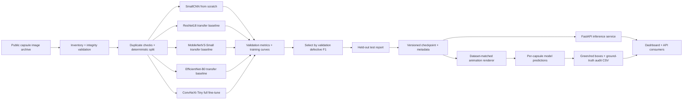
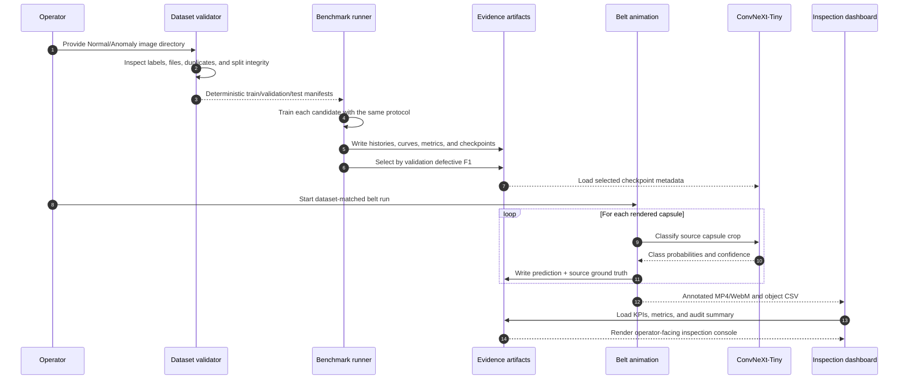
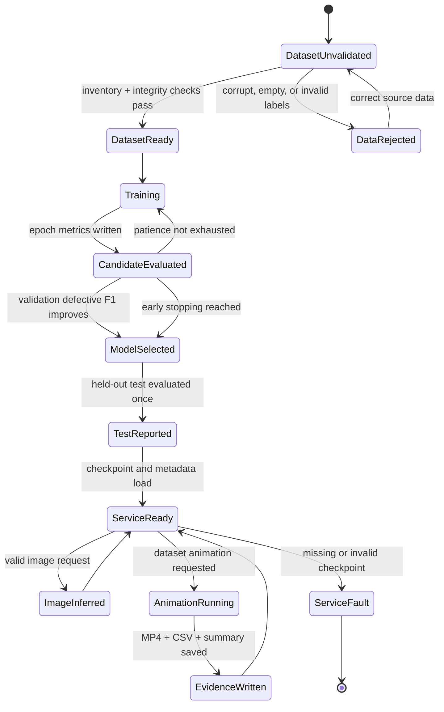
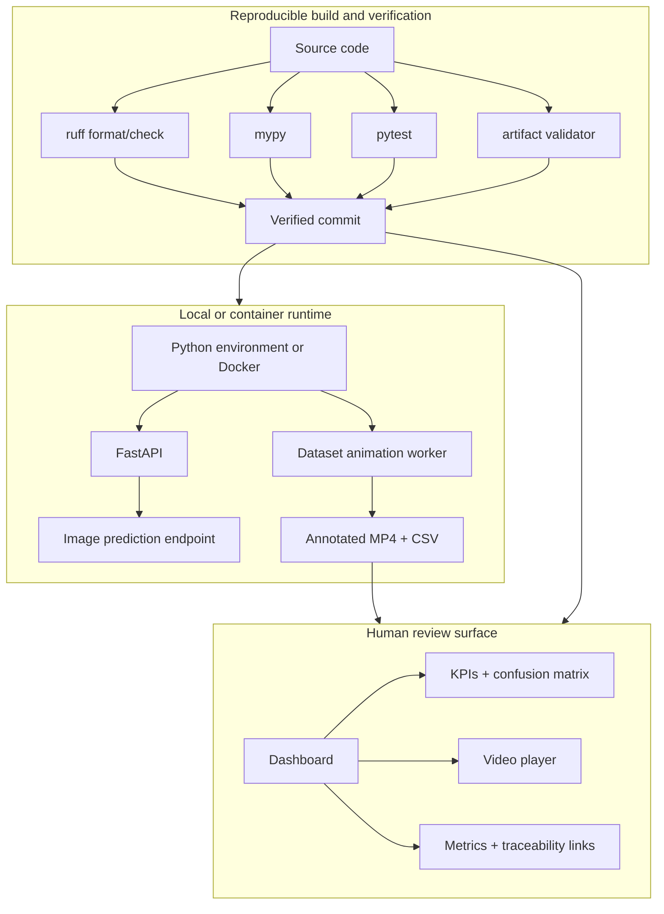

# Pharma Capsule Vision


Industrial computer-vision reference implementation for pharmaceutical capsule inspection. The project validates a public labelled capsule archive, trains and benchmarks five classifier families, evaluates a selected model on a fixed held-out split, and renders an auditable moving-belt animation from the same labelled capsule images. Every visible capsule is classified with green `normal` or red `defective` annotations and retained in an object-level CSV with ground truth.

## Live pipeline evidence

The following is the full dataset-matched capsule-belt animation. It contains 180 frames, 36 real source capsule images, and 6,480 object decisions. The animation is generated from the same `Normal`/`Anomaly` image archive used for training, so the CSV can compare every model prediction with the source label. Green boxes indicate predicted `normal`; red boxes indicate predicted `defective`.

<video controls preload="metadata" width="100%" poster="https://raw.githubusercontent.com/HUSNAIN-MUNAWAR/pharma-capsule-vision/main/artifacts/video-annotated-full/annotated_frame.png">
  <source src="https://raw.githubusercontent.com/HUSNAIN-MUNAWAR/pharma-capsule-vision/main/artifacts/video-annotated-full/annotated_full.mp4" type="video/mp4">
  Your browser does not support embedded video. Use the MP4 link below.
</video>

[Open or download the full annotated MP4](https://github.com/HUSNAIN-MUNAWAR/pharma-capsule-vision/raw/refs/heads/main/artifacts/video-annotated-full/annotated_full.mp4) | [Browser-compatible WebM](https://github.com/HUSNAIN-MUNAWAR/pharma-capsule-vision/raw/refs/heads/main/artifacts/video-annotated-full/annotated_full.webm)

## Project summary

| Area | Implementation |
|---|---|
| Inspection task | Binary capsule classification: `Normal` vs `Anomaly` |
| Image data | 1,200 public pharmaceutical capsule images: 600 normal and 600 anomalous |
| Model protocol | Four baseline families plus ConvNeXt-Tiny full fine-tuning; 100-epoch ceiling with early stopping |
| Selected model | ConvNeXt-Tiny, selected using validation defective-class F1 only |
| Held-out result | 1.0000 accuracy, precision, recall, and F1 on the fixed 180-image test split |
| Video integration | 180-frame dataset-matched belt animation with 6,480 per-capsule decisions |
| Animation audit | 6,300 / 6,480 predictions match source labels (97.22%; not factory-video accuracy) |
| Runtime | FastAPI `/health`, `/ready`, and `/predict` endpoints with structured request logs |
| Operator experience | Industrial dark-mode dashboard with video controls, KPI cards, confusion matrix, and evidence links |
| Engineering controls | Ruff, mypy, pytest, artifact validation, Docker, model card, and compliance checklist |

These metrics are evidence for this dataset split and protocol, not a production guarantee. Independent labelled factory data, threshold calibration, camera-shift testing, and operator review are required before deployment.

## Table of contents

- [Live pipeline evidence](#live-pipeline-evidence)
- [Project summary](#project-summary)
- [System architecture](#system-architecture)
  - [Architecture diagram](#architecture-diagram)
  - [End-to-end sequence](#end-to-end-sequence)
  - [Runtime state model](#runtime-state-model)
  - [Deployment and evidence flow](#deployment-and-evidence-flow)
- [Dataset and video alignment](#dataset-and-video-alignment)
- [Model training and benchmarking](#model-training-and-benchmarking)
- [Quickstart](#quickstart)
- [Inference API](#inference-api)
- [Industrial dashboard](#industrial-dashboard)
- [Repository layout](#repository-layout)
- [Quality gates](#quality-gates)
- [Compliance and limitations](#compliance-and-limitations)
- [Task alignment](#task-alignment)
- [References](#references)

## System architecture

### Architecture diagram



The training, rendering, and serving paths are separated. The API loads an immutable checkpoint at startup; it never silently retrains or downloads weights during a request. The dashboard consumes the service contract and versioned evidence artifacts instead of embedding training logic.

### End-to-end sequence



### Runtime state model



### Deployment and evidence flow



## Dataset and video alignment

The final evidence deliberately uses one labelled source of truth for both the model input and the moving-belt animation:

- The image dataset is a public research archive of pharmaceutical capsule inspection images from Chukyo University. It contains `Normal` and `Anomaly` labels and is used for supervised training and held-out evaluation.
- `scripts/generate_capsule_belt_animation.py` samples balanced real source images, creates three moving belt lanes, and retains each source path and class label.
- The selected `ConvNeXt-Tiny` checkpoint classifies each source capsule. Box color is driven by the prediction: green for `normal`, red for `defective`.
- `frame_predictions.csv` records frame number, object ID, source image, ground truth, predicted class, confidence, and box coordinates.
- `video_summary.json` records the seed, checkpoint, frame count, class counts, and animation-set audit result.

The checked-in run is 180 frames at 24 FPS, 7.5 seconds, with 36 unique source capsules and 6,480 object decisions. The 97.22% match rate is a controlled integration audit; it is not evidence of performance on a real production camera. Real target-line footage must be independently annotated for deployment acceptance.

Reproducible details are in [`docs/video_reference.md`](docs/video_reference.md). Dataset provenance and download instructions are in [`docs/dataset_provenance.md`](docs/dataset_provenance.md). Raw data, source videos, and local checkpoints are deliberately excluded from the public repository.

## Model training and benchmarking

All candidates use the same deterministic split (`808` train, `212` validation, `180` test), seed `42`, image size `128`, and a 100-epoch ceiling. The benchmark selects on validation defective-class F1; the test set is report-only.

| Model | Role | Accuracy | Defective precision | Defective recall | Defective F1 |
|---|---|---:|---:|---:|---:|
| EfficientNet-B0 | Frozen-head transfer baseline | 0.7833 | 0.8148 | 0.7333 | 0.7719 |
| MobileNetV3-Small | Lightweight transfer baseline | 0.7556 | 0.7447 | 0.7778 | 0.7609 |
| ResNet18 | Stable transfer baseline | 0.6000 | 0.6071 | 0.5667 | 0.5862 |
| SmallCNN | From-scratch control | 0.5000 | 0.0000 | 0.0000 | 0.0000 |
| ConvNeXt-Tiny | Full fine-tuning, selected run | **1.0000** | **1.0000** | **1.0000** | **1.0000** |

The ConvNeXt-Tiny run used official pretrained weights, full-backbone fine-tuning, learning rate `1e-4`, batch size `32`, ReduceLROnPlateau, and patience-10 early stopping. It stopped at epoch 18 with its best checkpoint at epoch 8. The checkpoint is intentionally not committed because it is approximately 106 MB; the documented command recreates it locally.

The animation uses the same selected checkpoint and class mapping as the image benchmark. Its 97.22% result is a repeated-placement audit over known labelled source images, not a second independent test split and not factory-video accuracy.

Evidence directories:

- [`artifacts/model-benchmark`](artifacts/model-benchmark): baseline benchmark CSV/JSON, logs, curves, and evaluation reports;
- [`artifacts/model-retrain`](artifacts/model-retrain): ConvNeXt-Tiny retraining run and selected evaluation evidence;
- [`artifacts/pharma-inspection/dataset_report.json`](artifacts/pharma-inspection/dataset_report.json): dataset inventory and integrity report;
- [`artifacts/video-annotated-full`](artifacts/video-annotated-full): playable video, poster, object CSV, and summary;
- [`compliance/model_card.md`](compliance/model_card.md): intended use, metrics, limitations, and risk notes.

### Reproduce the benchmark

```powershell
python scripts/benchmark_models.py `
  --data-dir data/real/pharmaceutical_capsules/extracted/datasets `
  --output-dir artifacts/model-benchmark `
  --models small_cnn resnet18 mobilenet_v3_small efficientnet_b0 `
  --epochs 100 `
  --patience 10 `
  --batch-size 64 `
  --device cpu
```

### Reproduce the selected ConvNeXt-Tiny run

```powershell
python scripts/benchmark_models.py `
  --data-dir data/real/pharmaceutical_capsules/extracted/datasets `
  --output-dir artifacts/model-retrain `
  --models convnext_tiny `
  --image-size 128 `
  --batch-size 32 `
  --learning-rate 0.0001 `
  --epochs 100 `
  --patience 10 `
  --fine-tune `
  --seed 42 `
  --device cpu
```

## Quickstart

### Install

```powershell
python -m venv .venv
.\.venv\Scripts\Activate.ps1
python -m pip install -e ".[dev]"
```

### Download the real capsule dataset

```powershell
New-Item -ItemType Directory -Force data/external | Out-Null
Invoke-WebRequest -Uri "https://isl.sist.chukyo-u.ac.jp/wp-content/uploads/2025/12/datasets.zip" -OutFile "data/external/medicinal_capsule_dataset.zip"
Expand-Archive data/external/medicinal_capsule_dataset.zip -DestinationPath data/real/pharmaceutical_capsules/extracted
```

### Inspect, train, evaluate, and render

```powershell
python -m defect_detector.cli inspect --data-dir data/real/pharmaceutical_capsules/extracted/datasets --output-dir artifacts/pharma-inspection
python -m defect_detector.cli split --data-dir data/real/pharmaceutical_capsules/extracted/datasets --output-dir data/processed/pharma-manifests --seed 42
python scripts/benchmark_models.py --data-dir data/real/pharmaceutical_capsules/extracted/datasets --output-dir artifacts/model-retrain --models convnext_tiny --image-size 128 --batch-size 32 --learning-rate 0.0001 --epochs 100 --patience 10 --fine-tune --seed 42 --device cpu
Copy-Item artifacts/model-retrain/convnext_tiny/best.pt models/best.pt -Force
python -m defect_detector.cli evaluate --data-dir data/real/pharmaceutical_capsules/extracted/datasets --checkpoint models/best.pt --output-dir artifacts/model-retrain/selected/evaluation --device cpu
python scripts/generate_capsule_belt_animation.py --data-dir data/real/pharmaceutical_capsules/extracted/datasets --checkpoint models/best.pt --output-dir artifacts/video-annotated-full --frames 180 --fps 24 --seed 42 --asset-count 36 --device cpu
```

## Inference API

The service loads the model configured by `DEFECT_MODEL_PATH` or defaults to `models/best.pt`.

```powershell
uvicorn defect_detector.api:app --host 0.0.0.0 --port 8000
curl.exe http://localhost:8000/health
curl.exe http://localhost:8000/ready
curl.exe -X POST http://localhost:8000/predict -F "file=@data/real/pharmaceutical_capsules/extracted/datasets/Anomaly/001.png"
```

Example response:

```json
{
  "request_id": "5b9a...",
  "predicted_class": "defective",
  "confidence": 0.9731,
  "probabilities": {"normal": 0.0269, "defective": 0.9731},
  "model_version": "convnext_tiny-seed42-epoch8"
}
```

The API validates content type, payload size, image readability, model readiness, and prediction output. Logs include request IDs and latency so a deployment can connect predictions to an operational trace.

## Industrial dashboard

The dashboard is a static operator-facing console served from the repository root. It presents the selected image benchmark, the dataset-matched object animation, green/red per-capsule overlays, the held-out confusion matrix, the animation-set audit, and direct evidence links.

```powershell
python scripts/serve_dashboard.py --port 8765
```

Open <http://127.0.0.1:8765/web/>. The player uses the browser-compatible [`annotated_full.webm`](artifacts/video-annotated-full/annotated_full.webm) and keeps [`annotated_full.mp4`](artifacts/video-annotated-full/annotated_full.mp4) as the MP4 fallback and download asset.


## Repository layout

```text
.
├── artifacts/       # benchmark reports, metrics, curves, screenshot, annotated video
├── compliance/      # data protection checklist and model card
├── docs/            # architecture, provenance, demo, and video reference
├── scripts/         # benchmark, animation, optional video inference, validation, server
├── src/             # typed application and ML package
├── testing/         # testing strategy and review notes
├── tests/           # unit and API tests
├── web/             # dashboard HTML, CSS, and JavaScript
├── Dockerfile
├── docker-compose.yml
└── pyproject.toml
```

Assessment inputs, raw data, source videos, local checkpoints, caches, and generated package metadata are excluded by [`.gitignore`](.gitignore). This keeps the public repository reproducible without publishing the task PDF or extracted task text.

## Quality gates

The implementation is checked with:

```powershell
ruff format --check src scripts tests testing
ruff check src scripts tests testing
mypy src
pytest
python scripts/validate_artifacts.py
```

The evidence package includes successful format/lint checks, static typing, unit/API tests, and artifact validation. The tests cover data discovery/splits, model construction, video proposal utilities, and API behavior.

## Compliance and limitations

- The capsule image dataset is public research data, not customer-owned production data. Do not represent these metrics as performance for a specific pharmaceutical company or factory.
- The published MP4 is a dataset-matched animation, not a recorded factory line. It provides exact source-label alignment for integration testing; it does not replace independently labelled target-camera footage.
- The classifier is image-level and does not localize defect pixels. Grad-CAM or a detection/segmentation model is the appropriate next step when operators require visual explanations.
- Before deployment, calibrate the threshold against the cost of missed defects and unnecessary manual review, then test lighting, camera, product, and line-speed shifts.
- The model checkpoint is excluded from the repository due to its size. A release workflow should publish versioned checkpoints through an artifact registry or Git LFS after governance approval.

See [`compliance/data_protection_checklist.md`](compliance/data_protection_checklist.md), [`compliance/model_card.md`](compliance/model_card.md), and [`docs/architecture.md`](docs/architecture.md) for the detailed controls.

## Task alignment

| Requested deliverable | Implementation status | Evidence |
|---|---|---|
| Real pharmaceutical dataset | Complete | Chukyo capsule archive, provenance document, dataset report |
| Matched moving-capsule video | Complete | Dataset-matched belt animation from the same labelled images |
| Green normal / red defective annotations | Complete | MP4/WebM, poster frame, and object predictions CSV |
| Train and compare multiple models | Complete | Four baselines plus ConvNeXt-Tiny full fine-tuning |
| Long-run training protocol | Complete | 100-epoch ceiling, scheduler, early stopping, saved histories |
| Benchmark evidence | Complete | Metrics JSON/CSV, curves, confusion matrices, logs |
| Professional application flow | Complete | Typed package, FastAPI service, structured logging, Docker |
| Testing and compliance structure | Complete | `tests/`, `testing/`, `compliance/`, lint, mypy, artifact validation |
| Professional UI | Complete | Industrial dashboard, screenshot, playable annotated video |
| Task PDF and extracted notes kept private | Complete | Explicit `.gitignore` rules; neither file is in Git history |

The repository is aligned with the requested dataset-matched animation and industrial software deliverables. The remaining production step is independent validation on labelled footage from the target pharmaceutical line; that is intentionally stated as a limitation rather than presented as completed evidence.

## References

- [Chukyo University industrial-vision archive](https://isl.sist.chukyo-u.ac.jp/)
- [TorchVision model catalog](https://docs.pytorch.org/vision/master/models.html)
- [Controlled packaging inspection study](https://doi.org/10.1145/3816713.3820244)
- [Pharmaceutical capsule inspection study](https://onlinelibrary.wiley.com/doi/10.1155/2022/4820618)
- [RACNN capsule inspection study](https://onlinelibrary.wiley.com/doi/10.1155/2020/8887723)
