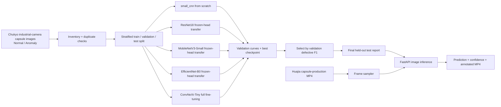

# Visual Defect Detector

Production-oriented computer vision reference implementation for classifying manufacturing product images as `normal` or `defective`.

Assessment inputs are intentionally excluded from this public repository. This repository uses a real pharmaceutical capsule inspection dataset from Chukyo University’s industrial-vision archive. Synthetic image data has been removed from the working dataset.

The raw dataset, source factory videos, and 106 MB trained checkpoint are also excluded from Git history. The documented download, training, and video-inference commands recreate them locally; compact metrics, curves, the dashboard screenshot, and the browser-playable annotated video are included as evidence.

## What is included

- Dataset inventory, corruption/duplicate checks, deterministic stratified train/validation/test manifests.
- PyTorch training with augmentation, class-weighted loss, early stopping, checkpoints, and reproducible seeds.
- Five benchmarkable model families: `small_cnn`, `resnet18`, `mobilenet_v3_small`, `efficientnet_b0`, and `convnext_tiny`.
- Precision, recall, F1, confusion matrix, confidence thresholding, and false-positive/false-negative error analysis.
- FastAPI inference service with input validation, structured logs, request IDs, health checks, and model readiness checks.
- Docker image, architecture documentation, model card, compliance checklist, tests, linting, and static typing configuration.

## Dataset contract

The loader accepts either the assessment names (`normal/defective`) or the source dataset names (`Normal/Anomaly`):

```text
data/raw/
├── normal/
│   ├── product-001.jpg
│   └── ...
└── defective/
    ├── product-101.jpg
    └── ...
```

The real dataset used here is:

```text
data/real/pharmaceutical_capsules/extracted/datasets/
├── Normal/    # 600 industrial-camera capsule images
└── Anomaly/   # 600 anomalous capsule images
```

or pass any directory containing `normal/` and `defective/` recursively with `--data-dir`. Supported formats are JPEG, PNG, BMP, TIFF, and WebP. A split is rejected when it cannot retain both classes, avoiding misleading validation metrics on tiny data.

## Quickstart

PowerShell:

```powershell
python -m venv .venv
.\.venv\Scripts\Activate.ps1
python -m pip install -e ".[dev]"

New-Item -ItemType Directory -Force data/external | Out-Null
Invoke-WebRequest -Uri "https://isl.sist.chukyo-u.ac.jp/wp-content/uploads/2025/12/datasets.zip" -OutFile "data/external/medicinal_capsule_dataset.zip"
Expand-Archive data/external/medicinal_capsule_dataset.zip -DestinationPath data/real/pharmaceutical_capsules/extracted

python -m defect_detector.cli inspect --data-dir data/real/pharmaceutical_capsules/extracted/datasets --output-dir artifacts/pharma-inspection
python scripts/benchmark_models.py --data-dir data/real/pharmaceutical_capsules/extracted/datasets --output-dir artifacts/model-benchmark --epochs 100 --patience 10 --batch-size 64 --device cpu
Copy-Item artifacts/model-retrain/convnext_tiny/best.pt models/best.pt -Force
python -m defect_detector.cli evaluate --data-dir data/real/pharmaceutical_capsules/extracted/datasets --checkpoint models/best.pt --output-dir artifacts/model-retrain/selected/evaluation --device cpu
uvicorn defect_detector.api:app --host 0.0.0.0 --port 8000
```

Then:

```powershell
curl.exe http://localhost:8000/health
curl.exe -X POST http://localhost:8000/predict -F "file=@data/real/pharmaceutical_capsules/extracted/datasets/Anomaly/001.png"
```

For video integration testing, follow [`docs/video_reference.md`](docs/video_reference.md) to download the real capsule-production MP4 and run `scripts/video_inference.py`.

For the real capsule dataset, the benchmark initializes the transfer-learning candidates from ImageNet weights when they are available, freezes their backbones, and trains their two-class heads on the capsule images. `small_cnn` is trained from scratch. The benchmark command below trains all four candidates on the same split.

## Training and evaluation

```powershell
python -m defect_detector.cli inspect --data-dir data/real/pharmaceutical_capsules/extracted/datasets --output-dir artifacts/pharma-inspection
python -m defect_detector.cli split --data-dir data/real/pharmaceutical_capsules/extracted/datasets --output-dir data/processed/pharma-manifests --seed 42
python scripts/benchmark_models.py --data-dir data/real/pharmaceutical_capsules/extracted/datasets --output-dir artifacts/model-benchmark --epochs 100 --patience 10 --batch-size 64 --device cpu
Copy-Item artifacts/model-retrain/convnext_tiny/best.pt models/best.pt -Force
python -m defect_detector.cli evaluate --data-dir data/real/pharmaceutical_capsules/extracted/datasets --checkpoint models/best.pt --output-dir artifacts/model-retrain/selected/evaluation --device cpu
```

The checkpoint stores the class mapping, normalization, image size, decision threshold, and training metadata. Evaluation writes `metrics.json`, `confusion_matrix.csv`, `errors.csv`, and a confusion-matrix PNG. In production, the threshold should be selected on validation data against the business cost of missed defects versus unnecessary manual inspection; the default `0.5` is only a starting point.

## Model benchmark and selection

Run the candidates against the same real Normal/Anomaly split:

```powershell
python scripts/benchmark_models.py `
  --data-dir data/real/pharmaceutical_capsules/extracted/datasets `
  --output-dir artifacts/model-benchmark `
  --models small_cnn resnet18 mobilenet_v3_small efficientnet_b0 `
  --epochs 100 `
  --patience 10 `
  --batch-size 64 `
  --device cpu
```

The script writes `benchmark.csv` and `benchmark.json`, selecting by best validation defective-class F1. The test-set metrics are report-only and are not used for model selection. Each model directory also contains `best.pt`, `run_config.json`, split manifests, `training_history.json`, `training_history.csv`, `training_curves.png`, and an evaluation directory. The protocol uses a 100-epoch ceiling, `ReduceLROnPlateau` (factor 0.2, patience 3), and early stopping after 10 validation epochs without defective-F1 improvement. This prioritizes catching defects while controlling manual-review volume. The final model should be selected from the benchmark plus measured p95 latency and operational review cost, not from accuracy alone.

The completed CPU baseline benchmark on the real dataset selected EfficientNet-B0 by validation defective-class F1. The test metrics below are final report-only measurements. All four models used seed 42, the same 808/212/180 stratified split, 128-pixel inputs, and batch size 64:

| Model | Params | Best / completed epoch | Train min | Accuracy | Defective precision | Defective recall | Defective F1 |
|---|---:|---:|---:|---:|---:|---:|---:|
| EfficientNet-B0 | 4.01M | 10 / 20 | 8.78 | **0.7833** | **0.8148** | 0.7333 | **0.7719** |
| MobileNetV3-Small | 1.52M | 57 / 67 | 8.46 | 0.7556 | 0.7447 | **0.7778** | 0.7609 |
| ResNet18 | 11.18M | 3 / 13 | 4.00 | 0.6000 | 0.6071 | 0.5667 | 0.5862 |
| SmallCNN | 0.09M | 1 / 11 | 4.58 | 0.5000 | 0.0000 | 0.0000 | 0.0000 |

### Stronger architecture search and ConvNeXt retraining

The initial benchmark trained only the classifier heads of pretrained backbones. A second search considered stronger industrial-inspection candidates: ConvNeXt-Tiny, EfficientNetV2-S, DenseNet121, Swin-Tiny, and ResNet50. TorchVision provides official pretrained weights for these model families in its model catalog. A recent controlled packaging study compared ResNet18, EfficientNet-B0, MobileNetV3-Small, and ConvNeXt-Tiny under the same protocol, while capsule-inspection research reports that domain-specific transfer learning and improved feature extraction can exceed 90% on related—but different—datasets. Those results are research references, not guarantees for this dataset. ([TorchVision model catalog](https://docs.pytorch.org/vision/master/models.html), [controlled packaging study](https://doi.org/10.1145/3816713.3820244), [pharmaceutical capsule inspection study](https://onlinelibrary.wiley.com/doi/10.1155/2022/4820618), [RACNN capsule study](https://onlinelibrary.wiley.com/doi/10.1155/2020/8887723))

| Candidate | Intended role | Status |
|---|---|---|
| ConvNeXt-Tiny | Modern high-capacity CNN; full fine-tuning | Selected and retrained |
| EfficientNetV2-S | Accuracy/efficiency trade-off for transfer learning | Candidate for follow-up |
| DenseNet121 | Dense multi-scale feature reuse for texture defects | Candidate for follow-up |
| Swin-Tiny | Windowed attention for fine-grained structure | Candidate for follow-up |
| ResNet50 | Deeper, stable CNN reference baseline | Candidate for follow-up |

ConvNeXt-Tiny was retrained with official pretrained weights and full-backbone fine-tuning (`learning_rate=1e-4`, batch size 32, 100-epoch ceiling, scheduler, and patience-10 early stopping):

```powershell
python scripts/benchmark_models.py `
  --data-dir data/real/pharmaceutical_capsules/extracted/datasets `
  --output-dir artifacts/model-retrain `
  --models convnext_tiny `
  --image-size 128 `
  --batch-size 32 `
  --learning-rate 0.0001 `
  --epochs 100 `
  --patience 10 `
  --fine-tune `
  --seed 42 `
  --device cpu
```

The ConvNeXt-Tiny run stopped at epoch 18 with its best checkpoint at epoch 8. On this fixed 180-image held-out test split (90 normal, 90 defective), it achieved 1.0000 accuracy, defective precision 1.0000, defective recall 1.0000, and defective F1 1.0000. This is strong evidence for this benchmark split, not a production guarantee; independent factory data and repeated validation are still required.

Promote the ConvNeXt-Tiny checkpoint for local API/Docker testing:

```powershell
Copy-Item artifacts/model-retrain/convnext_tiny/best.pt models/best.pt -Force
```

## Design decisions

ResNet18 remains a pragmatic baseline for a small visual dataset: it has a mature implementation, good CPU latency, and a transferable feature extractor. ConvNeXt-Tiny is the selected retrained model because full fine-tuning produced the highest measured result in this run. The final classifier is replaced with a two-class head. Augmentation is applied only to training data. Validation/test data use deterministic resizing and ImageNet normalization. Class-weighted cross entropy handles imbalance without duplicating samples; this is easy to audit and avoids changing the empirical test distribution.

The service is deliberately separated from training. The API loads an immutable checkpoint at startup and exposes `/health`, `/ready`, and `/predict`. It never silently retrains or downloads weights on a request. Invalid content types, oversized payloads, corrupt images, and missing model artifacts return explicit HTTP errors and structured logs.



The image and video assets are matched at the product/process-domain level: both concern pharmaceutical capsule manufacturing and inspection. The public image archive has ground-truth Normal/Anomaly labels; the company MP4 is not frame-labelled, so its use is an end-to-end video/domain-shift test rather than an accuracy benchmark.

## API response

```json
{
  "request_id": "5b9a...",
  "predicted_class": "defective",
  "confidence": 0.9731,
  "probabilities": {"normal": 0.0269, "defective": 0.9731},
  "model_version": "demo"
}
```

## Quality gates

```powershell
ruff check src scripts tests testing
mypy src
pytest
```

## Limitations and next steps

- The pharmaceutical dataset is public research data, not customer-owned production data. Do not report its metrics as performance for a specific pharmaceutical company or factory.
- The binary image-level formulation does not localize defect pixels. If operators need visual explanations, add Grad-CAM and review it with domain experts.
- Before deployment, calibrate the threshold, test camera/lighting/product-shift slices, add a human-review queue for low confidence, and record data lineage.
- The first production release should benchmark the actual camera resolution and hardware, export to ONNX/TensorRT if needed, and load-test p95/p99 latency.
- The assessment asks for a 2–3 minute video; `docs/demo_script.md` contains a concise recording outline and the recorded MP4 test command.

## Pharmaceutical factory video reference

The final pipeline test uses the real capsule-production MP4 from [Shijiazhuang Huajia Medicinal Capsule Co., Ltd.](https://www.hjjn.com.cn/hello-world/); see [`docs/video_reference.md`](docs/video_reference.md). Accura Pharmaquip’s official [Netra VS6 page](https://www.netra-accura.com/video.html) and its [inspection video 1](https://www.youtube.com/watch?v=fsGr3qTU8lQ) are additional inspection-machine references.

## Industrial inspection dashboard

The local dashboard is intentionally compact: active checkpoint, held-out metrics, full-run annotated video, confusion matrix, and direct evidence links. It uses the 871-frame ConvNeXt-Tiny annotated MP4 generated from the real capsule-production video.

```powershell
python scripts/serve_dashboard.py --port 8765
```

Open <http://127.0.0.1:8765/web/>. The player loads the browser-native [`annotated_full.webm`](artifacts/video-annotated-full/annotated_full.webm) and keeps [`annotated_full.mp4`](artifacts/video-annotated-full/annotated_full.mp4) as the MP4 fallback/download. Both contain an inference annotation on every source frame. The video is unlabeled, so the dashboard marks it as an integration/domain-shift asset rather than an accuracy set.


