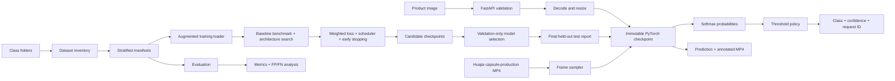

# Architecture

The selected retraining path is ConvNeXt-Tiny with official pretrained weights and full
backbone fine-tuning. The baseline models use frozen pretrained backbones and trained classifier
heads; the test set is report-only and is not used for model selection.

## Operational boundaries

- Training and evaluation are offline jobs; they write versioned artifacts and do not modify raw images.
- Inference is a read-only process over a checkpoint and does not download data or model weights at request time.
- The model decision is not a safety certification. Low-confidence predictions should be routed to manual review.
- The image dataset has Normal/Anomaly labels; the factory MP4 is unlabeled and is used for end-to-end video/domain-shift validation, not accuracy scoring.

